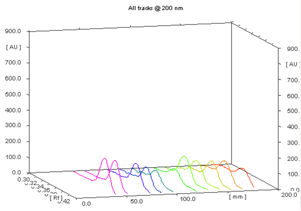
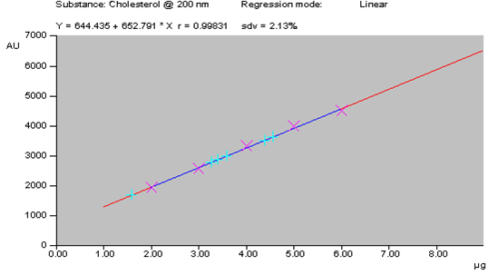

## Procedure

- A stock solution of standard cholesterol was prepared by dissolving cholesterol(0.05 mg/ml) in toluene and sonicated for 10 minutes over an ultrasonic bath.
- Edible oils were mixed with toluene and sonicated for 30 minutes for proper mixing.
- The solution was filtered through Whatman No. 41 filter paper and filtrate was used as sample solution.
- A 20cm × 10cm HPTLC plate coated with silica gel 60 F254 and alumina60 F254 (E. Merck, Darmstadt, Germany) was used for analysis.
- The samples were applied at 10 mm from the base of HPTLC plate by means of a Camag (Switzerland) Linomat V sample applicator using a syringe (100µL, Hamilton, Bonaduz, Switzerland).
- A linear calibration curve was obtained on applying the increasing concentration of standard amino acids in the range (200-1400 ng).
- HPTLC analysis was performed on a computerized densitometer scanner 3, controlled by WinCATS planar chromatography manager *version 1.4.4.* (CAMAG, Switzerland).
- Plate was developed to a distance of 80 mm, in a Camag twin-trough chamber with mobile phase [n-Hexane: Diethyl ether: MeOH:: 5:2:0.5 (v/v)].
- Plates were evaluated by densitometry at 200 nm with a Camag Scanner 3 for quantification.

## Observation

The chromatographic profile of the sample was simple, showing cholesterol as the main component. Peak of cholesterol was identified using the solvent system [n-Hexane: Diethyl ether: MeOH:: 5:2:0.5 (v/v)] with the Rf value of 0.37 ± 0.01 and there was no overlap with any other analyses of the sample at 200 nm (Fig.1).

**
Fig. 1: 3D display of cholesterol peaks
**

The linearity of the proposed method was confirmed in the range of 100-700 ng of standard cholesterol. A linear regression of the data points for standard cholesterol is resulted in a calibration curve with the equation *Y*=644.436 + 652.7908*x* [regression coefficient (*r2*) = 0.99831, standard deviation (S.D.) = 2.13%] (Fig. 2). Cholesterol content in edible oils was found to be in the range of 150-710 ng/spot selected for study (Table 1).

**
Fig. 2: Calibration curve of cholesterol
**

**Table1: Cholesterol levels in edible oils**

| **Edible oils** | **Cholesterol content [ng/spot ± S.D %]** |
|-----------------|-------------------------------------------|
| Coconut         | 150 ± 2.13                                |
| Mustard         | 280 ± 2.13                                |
| Taramira        | 320 ± 2.13                                |
| Soyabean        | 420 ± 2.13                                |
| Sunflower       | 560 ± 2.13                                |
| Peanut          | 710 ± 2.13                                |

The linearity, accuracy in terms of recovery % and precision was considered for the method. Validation of the method at three concentration levels was carried out by the standard recovery formula [9] returned a mean of 90.66%. Precision (repeatability) was determined by running a minimum of four analyses and the coefficient of variability was found to be 1.662 %. The limit of detection (LOD) and quantification (LOQ) was found to be 10 and 32 ng respectively.
