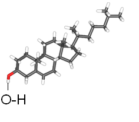

### Reagents

- Cholesterol Standard
- Coconut oil
- Soyabean oil
- Peanut oil
- Sunflower oil
- Mustard oil
- Taramira oil
- Methanol
- Toluene
- Diethyl ether
- n-Hexane
 

All chemicals used in this study must be of analytical grade.

### Theory

Cholesterol is a waxy steroid metabolite present in the cell membranes. Cholesterol has been found in vegetable oils as major components, where it could make up to 5% of the total sterols. It is a health-promoting substance and critical component of cell membranes as well as the precursor to all steroid hormones, bile acids as well as vitamin D. Many vegetable oils are consumed directly or used as ingredients in food. Cholesterol plays a vital role in the physiological regulation of membrane fluidity, proper functioning of cells, intracellular transport and nerve conduction. The body needs cholesterol to make steroid hormones, including the adrenal gland hormones and sex hormones.

  

There are several reasons for heart diseases but one of the most important reasons is Hypercholesterolemia i.e. the increased concentration of cholesterol in blood. Cholesterol, because of its high level in the body has been associated with coronary heart diseases. Excess of cholesterol increases the amount of fat in the body, result in gaining the excessive weight. Atherosclerosis is also one of the dangerous diseases caused by the high level of cholesterol. Therefore, the determination of the cholesterol is of great importance in establishing the quality of oils from health and regulation point of views.
